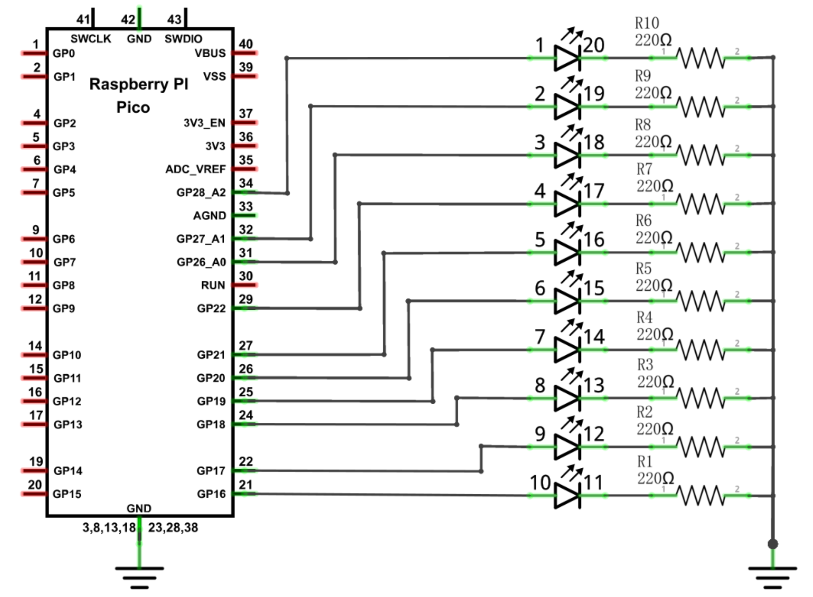

# PWM Waterfall LED bar

This project is a continuation of the [Waterfall LED bar](../06_waterfall/README.md) project. It uses PWM to control the brightness of the LEDs in the LED bar and create a more visually appealing effect due to the fading in and out of the LEDs.

