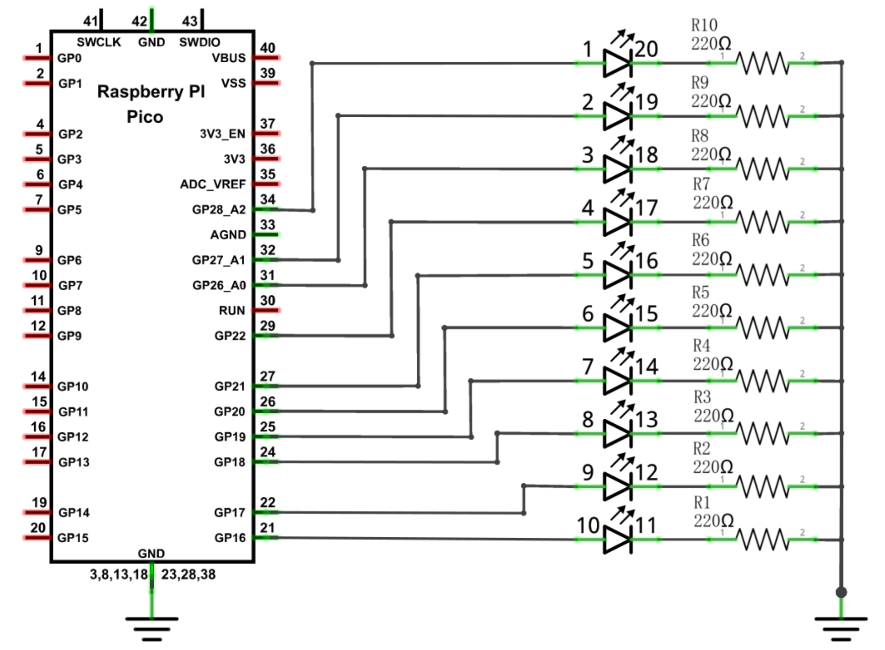

# Waterfall LED bar

This project is a simple example of how to make an external LED bar light up like a waterfall using the Raspberry Pi Pico. The LED bar is connected to GPIO pins 16-22 and 26-28.

